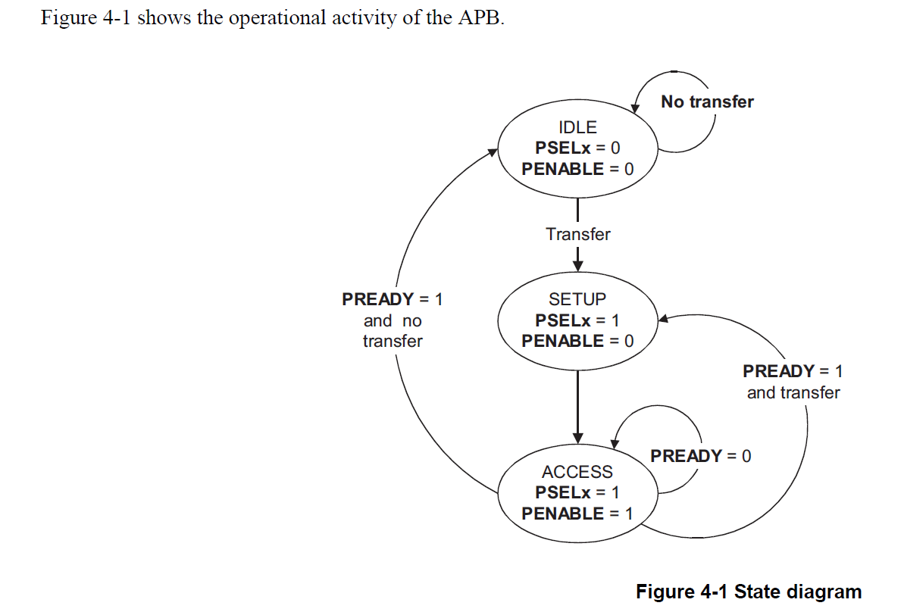
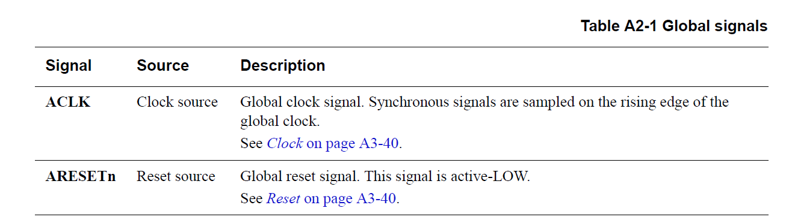
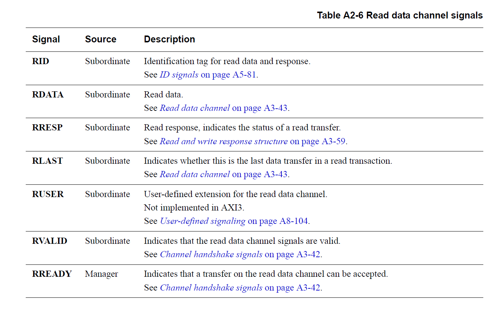
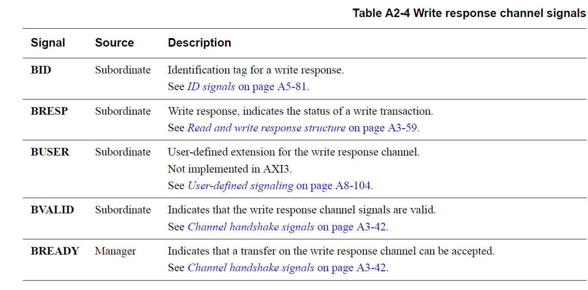

# axi-apb  

疑问：  

1. 为什么APB协议不能共用数据线，而是分成PRDATA以及PWDATA。 
2. 为什么AXI3和AXI4中，信号的依赖性不一致。AXI3中，Bvalid信号只要在Wvalid拉起后，就可以拉高。但是在AXI4中，则必须在AWVALID和WVALID信号都拉高后才可以拉高。有什么不同？存在不同的情形吗？  
3. 为什么需要last信号？  
   1. 如果没有last信号。主机端需要计算发出多少个数据(length、size)，当然，就算有last信号，主机也要计算。但是从机不一样，如果没有last信号，从机需要增加计数器，计算该次操作是否完成。  
   2. 对于写操作而言。AXI4由于没有wid信号，此时需要wlast信号拉起，告知从端，该次写数据操作已经完成了。(个人猜测，存在将写数据放到一些buffer中，然后才将数据写入从端，从而才能存在BID乱序的可能)
   3. 对于读操作而言，如果没有last信号，则需要主机计算已经接受了多少个数据，因此需要额外的计数器。  

## apb(Advanced Peripheral Bus)  

主要用于低速且低功率的外围  

系统信号：  
1. PCLK
2. PRESTn  

master端：  
1. PADDR：读写地址  
2. PSELx：哪一个从机进行操作  
3. PWRITE：high：write；low：read  
4. PWDARA：写数据  
5. PSTRB：选通信号，用于传输的数据位宽和总线位宽不一致的情形  
6. PENABLE：表明接下来会进行APB transfer  
7. 暂时用的少的信号：PPROT、PWAKEUP、PAUSER

从机端：  
1. PREADY：表示从机此时是否可以按主机的指示进行相应的操作  
2. PRDATA：读数据  
3. PSLVERR：错误  
4. 暂时用的少的信号：PRUSER、PBUSER  

  
&emsp;  

IDLE：默认状态，此时没有数据传输，PSEL以及PENABLE默认为0  
SETUP：PSELx信号拉高，总线在此停留一个周期。目的在于准备相应的数据  
ACCESS：PENABLE拉高，表明可以进行数据的转移。  

  

  

信号之间的关系：  
1. 当PSELx拉高时，addr以及pwrite信号必须有效。若为写事务，此时还要准备好写数据。并且此时需要把PENABLE拉低。  
2. PSELx拉高后的一个周期内，必须把PENABLE拉高。  
3. PREADY用于表示此次传输是否不需要等待。如果从机未准备好，则可以拉低此信号。此时PSELx、PADDR、PWRITE、PWDATA(若为写)、PENABLE等数据要保持不变。  
4. 在PREADY和PENABLE同时为高时，表明此次传输成功。需要把PSELx拉低。至于PREADY和PENABLE的信号未作规定。因为在PSELx拉高时，肯定会拉低PENABLE信号。而对于PREADY而言，完全取决于从机是否准备好了做相应的操作。  

## axi(Advanced eXtensible Interface)  

主要特性：  
1. 控制信息和数据信息通道的分离  
2. Register Slices。由于各个通道之间没有明显的关系，因此可以以延时为代价提高系统频率；以存储开销为代价减少关键路径。
3. burst传输可以减少控制信息通道的使用  
4. outstanding 以及 o-o-o 传输  

AXI通过采用握手机制(Handshake)进行信息的交互：一对Vaild和Ready信号，信号高为有效。  

Valid由动作发起者发出，表明我相关的信息准备好了。  
Ready由动作接收者发出，表明我可以接受相应的数据了。  
当Valid和Ready同时为高时，表明发起者和接收者都准备好了，此时一笔事务开始交易。  

特点：**两个信号相互独立，不依赖于对方是否有效。**  

因此两个信号存在三个关系。  
1. Valid先有效，Ready后生效。此时表明从机没有准备好接受主机发出来的信息。  
2. Ready先有效，Valid后生效。此时表明主机没有准备好发往从机的信息。  
3. 同时有效。  

测试点：  
1. Valid和Ready信号的三种情况。验证目的：判断两个信号是否独立，避免死锁。  
2. Valid信号置高后，只有等到Ready信号有效后才能置低。
3. Ready信号不做要求，可高可低。因为从机既可以在“我能接受信号了”和“我又不能接受信号了”两种状态横跳。spec推荐常为高。  

### 控制信息和数据信息的分离  

AXI能够实现高性能的一个原因在于：尽可能的分离相关事情(模块化，AXI按传输的类型将传输通道分为5个)，物尽其用(如果总线有空闲，在不影响传输判断的时候，尽可能利用起来，O-O-O)  

AXI将所有的数据传输分类为如下几个通道：  
读相关：AR R  
写相关：AW W B  

#### 读相关  

  
&emsp;  
&emsp; 

1. 主机在AR通道配置本次操作相关的控制信息(地址，burst类型，大小，长度等)，拉起ARValid信号  
2. 从机在接收到地址后，准备相应的数据，然后拉起RReady信号。  
3. 握手成功，开始数据的传输。  

   
&emsp;  
&emsp;  

  
&emsp;  
&emsp;  

地址通道信息可以从以下思考点分类：  
名字：ARID，在后续乱序执行中，便于识别那笔事务是哪笔事务  
地址：ARADDR  
需要读多少数据：ARLEN, ARSIZE  
传输类型：  
   1. 地址类型：ARBURST
   2. transaction类型：ARLOCK, ARCACHE, ARPORT  

暂时不理解的信号：ARQOS, ARREGION, ARUSER  
同步信号：ARVALID, ARREADY  

    
&emsp;  
&emsp;  

读数据通道信号：  
名字：RID  
数据：RDATA  
交易是否是最后一笔：RLAST  
是否传输成功：RRESP  
暂时不理解：RUSER  
同步信号：RREADY  

#### 写相关  

  
&emsp;  
&emsp;  

1. 主机在AW通道配置本次操作相关的控制信息，拉起ARValid信号。  
2. 主机在WD通道准备本次需要写的数据信息，拉起Wvalid信号。
3. 1，2步骤没有明确的依赖关系，两者的顺序可以打乱，具体见后面的依赖分析。  
4. 从机接收到写数据后，通过写回复通道，告知本次传输操作结束。  

写相关的写地址通道信号与读地址通道信号一致  

写数据通道相对于读数据通道，减少了RRESP信号(有单独的回应通道)，增加了一个SWTRB信号(该信号用于传输的数据位宽和总线位宽不一致的情形)  
**WID信号只在AXI3中实现，AXI4不支持。缘由见后续O-O-O**

由于写数据与写回应的信号发出主体不一致，因此需要一个单独的回应通道。  

  
&emsp;  
&emsp;  

### 通道信号之间的依赖关系  

VALID：表明master将相关控制或者数据信息准备妥当  
READY：表明slave已经准备按master的信号进行相应的动作  

### 读写交易信号的先后关系  

   
&emsp;
&emsp;  

读数据的产生一定要在读地址通道产生后。  

   
&emsp;
&emsp;  

如前所述，写地址通道和写数据通道并无明确的依赖关系。但是写回应一定在前两个通道之后。  

    
&emsp;
&emsp;  

增加了一个强关联，即Bvalid有效，一定要RValid和ARvalid信号有效。  
***即剔除了***，从机已经把数据写入成功了，开始拉起Bvalid信号。但是AWValid信号还没开始传送？(不是很理解 )  
//TODO  

### 地址结构  

AxLEN：4bit
1. AXI3：[1:16]  
2. AXI4：burst type = incr [1:256]; else [1:16]。此时AxLEN为8bit  
3. if burst_type == wrapping, AxLEN = [2|4|8|16]  

AxSIZE：3bit
1. [1|2|4|.....|64|128]  

AxBURST:2bit:  
1. FIXED：地址不变。用于FIFO的装载或排空  
2. INCR：地址递增。用于常规的内存顺序访问  
3. WRAP：开始地址必须对齐于每一个transfer的大小。长度必须为2，4，8，16.  

burst类型特点：  
1. 单次burst传输不能跨越4K边界  
2. 一次突发传输不能提前终止  
3. wrap传输，长度必须为2，4，8，16  

xRSP：  
RRESP：对于一笔burst，可以有多个RRSP  
BRESP：对于一笔burst，只能有一个BRESP  

Narrow Transfer:  
用于传输数据位宽小于通道本身的数据位宽。通过wstrb信号，控制那些信号有效。  

Unaligned Transfer：  
AXI协议支持非对齐传输，允许突发传输的首字节地址与突发传输位宽不对其。  
可以通过wstrb信号控制相应的数据信息是否有效，从而使得每次传输的地址对齐。  

Byte Invarience：  
在传输双方均不对数据结构的大小端进行解析转换，而严格按照字节的存储顺序进行传输并转存，防止大小端共存产生数据覆盖。  

## transaction属性  

涉及缓存，同步等相关概念。  
//TODO  

## O-O-O  

最简单的处理情形without outstanding：主机发送一个操作，从机返回一个操作。主机再发送一个操作，从机再返回一个操作。  

能否提高效率？  
存在一些场景，比如主机发送一笔操作，从机需要花费10个时间单位准备。此时能否一次发送多个操作，让从机早点准备好？    
outstanding：不需要等待前一笔操作完成，就可以发送下一笔操作。  

乱序是为了充分利用总线带宽，出现缘由是因为不同类型的事务处理时间不一致。

outstanding vs O-O-O：outstanding是指主机可以不等待数据的返回就发起下一笔操作；OOO是指从机反应主机的操作时，在某些情况，可以不按主机的顺序。而outstanding中从机的返回必须是顺序的。  

读乱序：  
1. 对于ARID一致的事务，从机必须按照主机的顺序返回  
2. 不同ARID的事务，可以乱序。比如主机依次发送ID0和ID1，从机可以先返回ID1的数据。  

写乱序：  
1. 对于AWID一致的事务，从机必须按照主机发出的顺序完成，也就是表明BID和AWID一致。  
2. 对于不同AWID的事务，可以乱序。  

AXI3 vs AXI4(WID):  
写数据交织(write data interleavin)功能：必须提供WID。比如对于AWID存在以下两个事务：ID0(trans0, trans1),ID1(tran0, trans1)。由于AXI提供了AWID、WID以及BID信号，因此我能清楚的知道我写的数据是对应哪个地址，我产生的回应信号是对于那个地址以及写数据。我可以以 ID0_trans0 ID1_trans0 ID2_trans1 ID0_trans1的形式进行写操作。此时我们保证了对于同一个ID，我们以顺序完成；对于不同ID，我们可以乱序。目的在于进一步提供总线利用率。    

如果没有WID信号，我们不能进行交织机制，因为我们不能确定我们当前所写的数据对应哪一个AWID。同时由于取消了WID信号，AXI4中的写数据必须按AWID的顺序。此时乱序是说，BID的返回可以不按顺序进行。比如从机接收到了AWID0，AWID1所对应的写数据，但是AWID0的那块地址区域因为某些原因不能写，所以可以先写AWID1所对应的数据，此时可以先返回BID1。  

总之，OOO和interleaving的区别在于操作粒度，OOO对应于一个事务，而交织对应一个事务里面的多笔分割的操作。  

//TODO 可以构造一些相应的场景进行阐释
